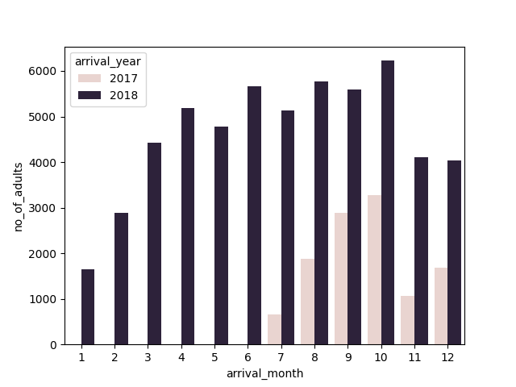
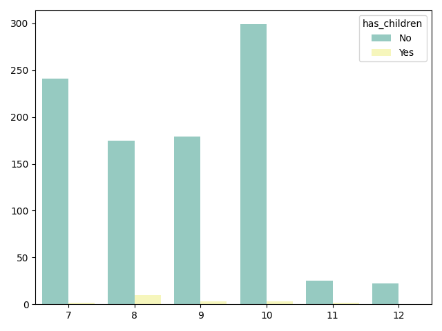
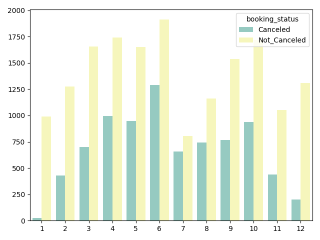

#  Análisis y Predicción de Cancelaciones de Reservas Hoteleras

##  1. Introducción al Proyecto

Este proyecto aborda el problema de la **incertidumbre en la ocupación** en la industria hotelera, centrándose en el análisis exhaustivo de los patrones de reserva y cancelación. El objetivo principal es pasar de una gestión reactiva a una **gestión proactiva del riesgo** mediante el uso de Machine Learning.

### Fuente de Datos
Se utiliza el conjunto de datos **`reservas_hoteles.csv`**, que compila más de **36,000 registros de reservas** históricas, cubriendo un período de 18 meses (julio de 2017 a diciembre de 2018).

### Objetivo del Modelado
El proyecto persigue un objetivo dual:

1.  **Análisis Exploratorio (EDA):** Identificar las **tendencias de demanda**, las **tasas de cancelación por segmento** y los factores socioeconómicos/temporales que impulsan la cancelación.
2.  **Modelado Predictivo:** Desarrollar un modelo de clasificación (**Decision Tree**) con alta **sensibilidad (Recall)** para predecir si una reserva en el momento de la entrada será cancelada. La predicción temprana permite a la gerencia activar protocolos de mitigación de riesgo, como ajustar la sobreventa o contactar a los huéspedes de alto riesgo.

---
## 2. DESCRIPCION DE VARIABLES.

**`Booking_ID`** | Categórico | Identificador único de cada reserva (ej. INN00001). | Se elimina. No tiene valor predictivo. |\
| **`no_of_adults`** | Numérico | Número de adultos incluidos en la reserva. | Factor demográfico y de ocupación. |\
| **`no_of_children`** | Numérico | Número de niños incluidos en la reserva. | Factor demográfico y de ocupación. |\
| **`no_of_weekend_nights`** | Numérico | Número de noches de fin de semana (sábado o domingo) reservadas. | Duración de la estancia. |\
| **`no_of_week_nights`** | Numérico | Número de noches de días laborables (lunes a viernes) reservadas. | Duración de la estancia. |\
| **`type_of_meal_plan`** | Categórico | Tipo de plan de comidas elegido (ej. Meal Plan 1, Not Selected). | Factor de *engagement* y gasto del cliente. |\
| **`required_car_parking_space`** | Binario | Indica si se solicitó una plaza de aparcamiento (1) o no (0). | Factor de demanda de servicios adicionales. |\
| **`room_type_reserved`** | Categórico | Tipo de habitación reservada (ej. Room\_Type 1, Room\_Type 4). | Impacto en la tarifa y la disponibilidad. |\
| **`lead_time`** | Numérico | **Tiempo de Anticipación.** Número de días entre la fecha de reserva y la fecha de llegada. | **CRÍTICA.** Principal predictor de cancelación. |\
| **`arrival_year`** | Numérico | Año de llegada del huésped. | Factor temporal. |\
| **`arrival_month`** | Numérico | Mes de llegada del huésped. | Factor estacional de deman\da. |\
| **`arrival_date`** | Numérico | Día del mes de llegada del huésped. | Factor temporal. |
| **`market_segment_type`** | Categórico | Canal por el que se hizo la reserva (Online, Offline, Corporate, Aviation, Complementary). |\ **CRÍTICA.** Define el comportamiento de cancelación. |\
| **`repeated_guest`** | Binario | Indica si el huésped es recurrente (1) o nuevo (0). | Fidelidad del cliente. |\
| **`no_of_previous_cancellations`** | Numérico | Número de cancelaciones previas del mismo huésped. | Historial de riesgo del cliente. |\
| **`no_of_previous_bookings_not_canceled`** | Numérico | Número de reservas completadas previamente por el huésped. | Historial de fidelidad. |\
| **`avg_price_per_room`** | Numérico | Precio promedio diario de la habitación para la estancia. | Factor económico. |\
| **`no_of_special_requests`** | Numérico | Número de solicitudes especiales realizadas por el huésped (ej. cuna, vistas). | Nivel de compromiso del huésped. |\
| **`booking_status`** | Categórico | **VARIABLE OBJETIVO.** Estado final de la reserva ('Canceled' o 'Not\_Canceled'). | **Variable a predecir.** |\

## 3. Análisis Exploratorio de Datos (EDA)

 En base a los datos recopilados dureste este periodo de tiempo, se realizan distintos analisis de las reservas fueron o no canceladas en funcion de las distintas varaibles. 

Esta fase se centró en comprender la estructura de los datos, la distribución de las cancelaciones y la influencia de las variables clave (temporales, demográficas y económicas). Se identificaron y trataron valores atípicos (*outliers*) y datos faltantes para garantizar la calidad del modelado posterior.

### 3.1. Subconjunto Inicial de Variables Demográficas y Temporales

Se inició el análisis enfocándose en las variables que definen la **composición de la reserva y su duración**, excluyendo de inmediato las variables categóricas o las de riesgo histórico.

| Variable | `dataset_2.head()` |
| :--- | :--- |
| **`arrival_year`** | 2017, 2018, ... |
| **`arrival_month`** | 10, 11, 2, ... |
| **`no_of_adults`** | 2, 2, 1, ... |
| **`no_of_children`** | 0, 0, 0, ... |
| **`no_of_weekend_nights`** | 1, 2, 2, ... |
| **`no_of_week_nights`** | 2, 3, 1, ... |

 ### 3.2  Precio promedio por habitación por mes y estado de la reserva
    

El análisis del precio promedio por habitación (`avg_price_per_room`) a lo largo de los meses revela una pauta de comportamiento de riesgo clave. 

**Interpretación del Gráfico:**

1. **Precio como Predictor de Riesgo:** La tendencia más significativa es que, en **casi todos los meses**, el **precio promedio de las  reservas canceladas (línea roja)** es **significativamente más bajo** que el precio promedio de las reservas no canceladas (línea azul).
  **Implicación:** Esto sugiere que las **tarifas con descuento o las ofertas de bajo costo** están asociadas a un **mayor riesgo de cancelación**. Es probable que los clientes con tarifas más bajas reserven múltiples opciones y cancelen la que no sea la mejor (el fenómeno de *rate-shopping* o *shopping-around*).

2. **Estacionalidad y Demanda:** Se observa que las líneas convergen o se acercan en los meses de **alta demanda** (ej. Julio-Agosto), donde la diferencia de precio entre una reserva cancelada y una no cancelada se reduce, debido a la escasez de oferta general.

3. **Acción de Negocio:** El hotel debe **reevaluar sus políticas de precios con grandes descuentos**. Las promociones deben ser revisadas para asegurar que el aumento de volumen compense el alto riesgo de cancelación asociado a esas tarifas.

### 3.3 Precio promedio por segmento de mercado y estado de la reserva

**Interpretación del Gráfico:**

1.  **Patrón de Riesgo Consistente:**
    * En los segmentos de **Online** y **Offline** (que históricamente tienen altas tasas de cancelación), se observa una tendencia clara: el precio promedio de las reservas canceladas es **notablemente inferior** al de las reservas no canceladas. Esto refuerza la idea de que la cancelación en estos canales está fuertemente impulsada por la **sensibilidad al precio** y la búsqueda de ofertas (*rate-shopping*).

2.  **Reservas de Alto Compromiso (Bajo Riesgo):**
    * En los segmentos **Corporate** (Corporativo), **Aviation** (Aviación) y **Complementary** (Cortesía), la diferencia de precio entre reservas canceladas y no canceladas es **mínima o inexistente**.
    * **Implicación:** Esto indica que, en estos segmentos, las cancelaciones no se deben a la búsqueda de mejores tarifas, sino a **factores externos** (como cambios en los itinerarios de negocios o políticas fijas), lo que hace que estas reservas sean **más predecibles** y de menor riesgo asociado al precio.

3.  **Acción de Negocio:**
    * El hotel debe diseñar **políticas de precios dinámicas** que mitiguen el riesgo específicamente en los canales **Online/Offline**, quizás ofreciendo tarifas con descuento solo con políticas de **no-reembolsables** o penalizaciones más estrictas.

### 3.3 CANTIDAD DE ADULTOS QUE SER REGISTRARON POR MES EN LOS AÑOS 2017 Y 2018

**Interpretación del Gráfico:**

1.  **Cobertura Temporal de los Datos:**
    * El gráfico confirma visualmente que los datos del año 2017 (barras azules) solo están disponibles a partir de **Julio**. Por el contrario, 2018 (barras naranjas) presenta datos completos para los 12 meses. Esto es crucial para no malinterpretar una "falta de demanda" en el primer semestre de 2017.

2.  **Estacionalidad y Picos de Ocupación:**
    * Se observan picos consistentes de afluencia de adultos hacia **Octubre y Septiembre/Diciembre**, lo que sugiere temporadas altas específicas para este hotel (posiblemente turismo de conferencias o festividades, dependiendo de la ubicación).

3.  **Comparativa Interanual (Julio - Diciembre):**
    * Al observar los meses donde ambos años se superponen (Julio a Diciembre), podemos evaluar el crecimiento. Si las barras naranjas (2018) superan consistentemente a las azules (2017) en estos meses, indica un **crecimiento positivo de la demanda** año contra año.

### 3.4 RESERVAS CANCELADAS AÑO 2017 EN FUNCION DE LA PRESENCIA DE NIÑOS EN LA RESERVA

**Interpretación del Gráfico:**

1.  **Volumen Dominante (Sin Hijos):**
    * Se observa que la inmensa mayoría de las cancelaciones provienen de reservas **sin niños** (barras de mayor altura). Esto es consistente con la tipología habitual de hoteles de ciudad o negocios, donde el viajero corporativo o de pareja es más volátil.

2.  **Comportamiento Estacional de Familias:**
    * Las cancelaciones de reservas **con hijos** (barras de menor altura) muestran un comportamiento más estable, aunque pueden tener ligeros repuntes en meses de vacaciones escolares (Julio/Agosto).
    * **Implicación:** Las familias suelen planificar sus viajes con mayor antelación y tienen menos flexibilidad para cambiar fechas a última hora, lo que a menudo se traduce en una **tasa de cancelación menor** o más predecible en comparación con el segmento corporativo.

3.  **Acción de Negocio:**
    * Dado que las reservas con niños suelen ser de mayor valor (habitaciones más grandes, mayor gasto en alimentos y bebidas), el hotel puede permitirse políticas de cancelación ligeramente más flexibles para este segmento como incentivo de venta, dado que su riesgo inherente de cancelación es menor en volumen.

### 3.5 RESERVAS CANCELADAS AÑO 2019 EN FUNCION DE LA PRESENCIA DE NIÑOS EN LA RESERVA
## Tasa de Cancelación Mensual por Segmento Familiar (Año 2018)

**Interpretación del Gráfico:**

Este gráfico permite contrastar la **volatilidad de la reserva** entre familias y otros tipos de viajeros a lo largo de las estaciones del año.

1. **Impacto del Factor "Hijos" en la Estabilidad**
     **Hipótesis de Negocio:** Se asume que el segmento `has_children` (Familias) posee una menor tasa de cancelación debido a la complejidad logística de organizar viajes grupales.
     **Lectura del Gráfico:** Observar si las barras correspondientes a "Con Hijos" son consistentemente más bajas que las de "Sin Hijos" en todos los meses.
     **Si la brecha es amplia:** Confirma que las familias son un segmento "seguro" para el Revenue Management.
     **Si la brecha es estrecha:** Indica que en 2018, las familias cancelaron casi tanto como los viajeros individuales (posible señal de inestabilidad externa).

2. **Estacionalidad del Riesgo (Mes a Mes)**
     **Identificación de Picos:** Las barras más altas indican los meses donde el hotel sufre más pérdidas de reservas.
     **Temporada Alta (Verano/Invierno):** Si las cancelaciones suben en estos meses, sugiere reservas especulativas (clientes que reservan en varios hoteles y cancelan a última hora).
     **Temporada Baja:** Si las cancelaciones son bajas aquí, el ingreso es más predecible aunque el volumen sea menor.

3. **Acción de Negocio:**
     Basado en los resultados visuales de 2018:
     **Ajuste de Políticas:** En los meses donde la tasa (Eje Y) supera el umbral crítico (ej. > 0.3 o 30%), se recomienda eliminar las tarifas flexibles.
     **Previsión de Demanda:** El equipo de reservas puede utilizar la tasa histórica de este gráfico para calcular el "Net Booking" real esperado para el próximo año, descontando el porcentaje de cancelación previsto según si el cliente viene con hijos o no.

### 3.6 RESERVAS CANCELADAS, EN FUNCION DE LAS RESERVAS SOLICITADAS.

### Interpretación de Grafico

1. **Picos de Demanda (Temporadas Altas):**
    * La altura total de las barras (la suma visual de canceladas + no canceladas) indica los meses de mayor actividad comercial.

2. **Volumen de "Desperdicio" (Cancelaciones):**
    Las barras correspondientes a `Canceled` representan el costo de oportunidad y trabajo administrativo perdido.
    Si en un mes de alta demanda la barra de "Canceladas" es casi tan alta como la de "No Canceladas", indica un problema grave de retención de ventas (overbooking mal gestionado o precios disparados que el cliente rechaza después).

3. **Implicaciones Operativas**
   Este gráfico es esencial para la planificación de recursos humanos (`Staffing`):
   En los meses con barras totales más altas, se requiere más personal en Recepción y Reservas, independientemente de si esas reservas se cancelan o no, ya que el trámite administrativo de gestionar la reserva (y su cancelación) consume horas de trabajo.

### 4. Metodología y Justificación del Procedimiento
El enfoque analítico se diseñó siguiendo un flujo de trabajo riguroso dividido en etapas estratégicas, priorizando tanto l  precisión matemática como la interpretabilidad del negocio.

1. **Preparación y Exploración de Datos**
    Definición del Objetivo: Se estableció booking_status como la variable dependiente (y) y se separó del resto de atributos (X)para evitar el data leakage (fuga de datos).

    Análisis de Desbalance: Mediante y.value_counts(normalize=True), se diagnosticó que las Reservas Canceladas representan el ~3276% del total frente al 67.24% de las No Canceladas.

    Justificación: Una proporción de 1:2 justifica el monitoreo de métricas específicas (como Recall) más allá de la simpleExactitud, ya que un modelo sesgado podría ignorar la clase minoritaria.

2. **Estrategia de Validación (Data Splitting)**
    Para garantizar una evaluación justa, se dividió el dataset en dos subconjuntos: Entrenamiento (70%) y Prueba (30%).

    Decisión Técnica Clave (stratify=y): Debido al desbalance detectado, se utilizó una división estratificada. Esto fuerza alalgoritmo a mantener la misma proporción de clases en ambos conjuntos, evitando que el set de prueba sea poco representativo dela realidad.

3. **Ingeniería de Características (Preprocessing)**
    Se aplicó una estrategia diferenciada según el tipo de dato:

    Codificación de Variables Categóricas: Se utilizó One-Hot Encoding para variables nominales (ej. market_segment_type).

    Optimización: Se excluyeron identificadores únicos (Booking_ID) del encoding para evitar la "maldición de la dimensionalidad"(generar más de 40,000 columnas irrelevantes).

    Manejo de Variables Numéricas: Variables como lead_time y avg_price_per_room se mantuvieron en su formato original, aprovechandola capacidad de los árboles de decisión para manejar magnitudes sin necesidad de escalado.

    Transformación del Target: Se convirtió la variable objetivo a formato binario para el cálculo de métricas:

    Not_Canceled ➝ 1

    Canceled ➝ 0

4. **Consolidación y Limpieza Final**
    Reconstrucción: Se concatenaron las variables numéricas originales con las nuevas variables codificadas, asegurando laalineación de índices.

    Tratamiento del Test Set: Se aplicó transform() (no fit()) al conjunto de prueba para simular un escenario real y evitar fugasde información.

    Feature Selection: Se eliminaron las columnas   de texto originales, resultando en una matriz     100% numérica lista para Scikit-Learn.

### 5. Selección y Configuración del Modelo
Se optó por un Decision Tree Classifier     frente a modelos de "caja negra" por su     interpretabilidad, permitiendo trazar   reglas denegocio explícitas (ej. "Si el   lead_time > 100, aumenta el riesgo").

Hiperparámetros utilizados:

Profundidad (max_depth=10): Se limitó la    profundidad para controlar el sobreajuste  (overfitting).

Semilla (random_state=42): Para     garantizar la reproducibilidad de los   experimentos.

### 6.  Análisis de Resultados
El modelo fue evaluado utilizando el conjunto de prueba (Test Set) con 10,883 reservas inéditas.

1. **Reporte de Clasificación**
    
                                precision    recall  f1-score  support

                Canceled           0.84      0.79      0.81      3566
                Not_Canceled       0.90      0.92      0.91      7317
                accuracy                               0.88     10883
2. **Interpretación de Métricas de Negocio**
    Dado que el objetivo es minimizar las pérdidas por cancelaciones, el análisis se centró en la clase minoritaria (Canceled):

    Capacidad de Detección (Recall: 79%):

    El modelo identifica correctamente a casi 8 de cada 10 clientes que van a cancelar. Esto permite al hotel revender esas habitaciones con antelación, recuperando ingresos potenciales.

    **Fiabilidad de la Alerta (Precision: 84%):**

    Cuando el modelo marca una reserva como "Riesgo", tiene una probabilidad del 84% de estar en lo cierto, permitiendo al equipo de ventas     confiar en las alertas sin perder tiempo en falsos positivos.

3. **Visualización (Matriz de Confusión)**
    El análisis visual mediante el mapa de calor (seaborn.heatmap) confirmó que el modelo discrimina efectivamente entre clases. Se observó     un equilibrio saludable en la diagonal principal (aciertos) y un control aceptable de los Falsos Negativos (el error más costoso).

### 7. Conclusiones del Proyecto
El flujo de trabajo implementado permitió transformar datos brutos en un sistema predictivo funcional con una Exactitud Global del  88%.

Robustez: La mínima diferencia entre la exactitud de entrenamiento (89%) y prueba (88%) confirma que el modelo no sufre de  sobreajuste (overfitting) y generaliza bien ante nuevos datos.

Utilidad: La metodología aplicada (One-Hot Encoding selectivo + Estratificación) aseguró que el modelo fuera justo al evaluar las   cancelaciones.

Impacto: Los resultados sugieren que este enfoque puede ser utilizado por la gerencia del hotel para anticiparse a la demanda real,     permitiendo aplicar políticas preventivas (como solicitar depósitos) en las reservas identificadas como de alto riesgo.